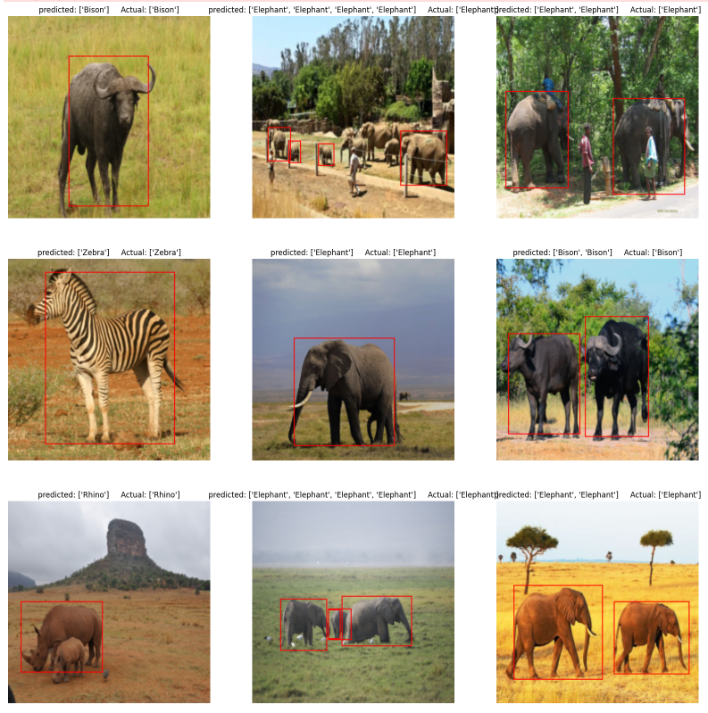

# 🦁 African Wildlife Detection with Faster R-CNN

This project implements an object detection system to classify and localize African wildlife species using the **Faster R-CNN** model with a **ResNet50 FPN** backbone. Built with PyTorch, the system was trained and evaluated on the [African Wildlife Dataset](https://www.kaggle.com/datasets/biancaferreira/african-wildlife).

---

## 📌 Project Objective

To accurately identify and locate animals in wildlife images, helping support efforts in conservation, monitoring, and automated analysis of African fauna.

---

## 📁 Dataset

- **Source**: [Kaggle - African Wildlife Dataset](https://www.kaggle.com/datasets/biancaferreira/african-wildlife)
- **Contents**: High-quality images of wildlife species with bounding box annotations for:
  - Elephant
  - Zebra
  - Lion
  - Giraffe
  - Buffalo
  - Rhino

---

## 🛠️ Tools & Technologies

- **Language**: Python
- **Libraries**: PyTorch, Torchvision, Pandas, NumPy, PIL, Matplotlib
- **Model**: Faster R-CNN with ResNet-50 FPN (Feature Pyramid Network)
- **Notebook**: `reban-miniproject.ipynb`

---

## 🔍 Features

- Custom dataset loader for bounding box annotations
- Image augmentation and transformation pipeline
- Transfer learning with pretrained Faster R-CNN
- Visualization of predictions with bounding boxes
- Train/validation/test splitting and evaluation

---

## 🖼️ Sample Prediction

 <!-- Add an actual image path from your repo -->

---

## 🚀 How to Run

1. Clone this repository
2. Download the dataset from Kaggle and place it in your working directory
3. Open `Animal Identification.ipynb` in Jupyter or Colab
4. Run all cells to train and evaluate the model

---

## 📈 Results

The model demonstrates strong performance in recognizing and localizing multiple animals in diverse scenarios, even with limited data.

---

## 🙋‍♂️ Author

**Reban Mark**  
📍 Coimbatore, India  
📫 [rebanmark1234@gmail.com](mailto:rebanmark1234@gmail.com)

---

## ⭐ Acknowledgements

- [Bianca Ferreira](https://www.kaggle.com/biancaferreira) for the African Wildlife dataset
- PyTorch and Torchvision teams for the robust model support

---

## 🐾 Contributions

Feel free to fork the repo, raise issues, and contribute improvements or new features!

